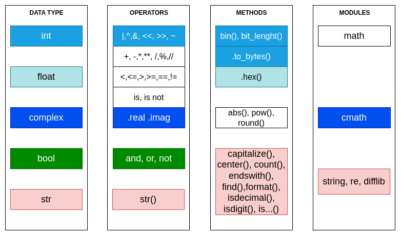

# Python

- [Python](#python)
  - [Main features](#main-features)
  - [Data types](#data-types)
    - [Simple data types](#simple-data-types)
    - [Data structures - Sequence types](#data-structures---sequence-types)
      - [Mutable structures](#mutable-structures)
      - [Immutable structures](#immutable-structures)
    - [Special data types](#special-data-types)
  - [Buil-in function list](#buil-in-function-list)
  - [Input/Output](#inputoutput)
  - [Flow control](#flow-control)
    - [Conditionals](#conditionals)
    - [Loops](#loops)
    - [Case](#case)
    - [Method definition](#method-definition)
  - [Functional programming](#functional-programming)


## Main features
Python is an interpreted scripting/programming language. There are differents supported programming paradigms in Python:

* Imperative
* Object-oriented
* Functional

Other main features are: 
* Dynamic typing
* Case-sensitive

For a complete reference of the Python STD lib, take a look [here](https://docs.python.org/3/library/index.html).

## Data types

### Simple data types
These are the main view of the data types on Python with the operators and some methods and the related modules for more operations. 

Also there is an special type named `NoneType` to represent the absence of a value.




### Data structures - Sequence types
There are two main types of data structures, mutable and immutable. For these two main groups, there are common operations:

| Operation                                            | Syntax        |
| ---------------------------------------------------- | ------------- |
| Element presence, not presence                       | in, not in    |
| Concatenation, Itself concatenation                  | +, *          |
| Element access, Slice access, Slice access with step | [], [:], [::] |
| lenght                                               | len()         |
| smallest, largest element                            | min(),max()   |
| First occurrence of element                          | index()       |
| Number of occurences                                 | count()       |

#### Mutable structures
* List `[]`
* Dict`{}`
* Set `set()`

#### Immutable structures
* Tuple `()`
* Range `range()`
* str `''` or `""` or `""""""` (multi line support)
* fronzenset `frozenset()`

### Special data types


## Buil-in function list


## Input/Output

## Flow control
As an imperative language, Python has loops and conditional structures:

### Conditionals
The conditionals on Python has the following syntax, where cond{1,2,3} are bool values:
```python
if cond1:
  whatever()
  whatever2()
elif cond2 or cond3: 
  whateverG()
else:
  whateverA()
```

### Loops

Python has two looping strucutres, `while` and `for`, with the following syntax

```python
while cond1:
  whateverA()
  whateverB()
  whateverC()

```

```python
for it in sequence:
  whateverA()
  whateverB()
  whateverC()
```
### Case
Called `match` and introduced since Python3.10:
```python
 match status:
        case 400:
            return "Bad request"
        case 401 | 403 | 404:
            return "Not allowed"
        case 404 if cond1:
            return "Not found"
        case 418:
            return "I'm a teapot"
        case _:
            return "Something's wrong with the internet"
```

Python has other control flow statements:
* `break` for exit a loop.
* `continue` for going directly to the next iteration.
* Placing an `else` in a `for`/`while`, the code in thi scope will be executed after the last iteration (if not used `break` to exit the loop).
* `pass` as a non-operation statement for complain the syntax.

### Method definition
For define a method/subroutine/function on Python `def` keyword is used.


## Functional programming
Python supports functional programing, using lambda-functions and top-level methods.

