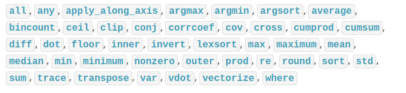

# NUMPY Basics

Provides support for scientific computing in Python adding N-array operations to the Python Lang.

- [NUMPY Basics](#numpy-basics)
  - [Numbers generation](#numbers-generation)
  - [Arrays](#arrays)
    - [Creation](#creation)
    - [Indexing, slicing and iterating](#indexing-slicing-and-iterating)
    - [Manipulation](#manipulation)
  - [Object copies](#object-copies)

## Numbers generation

Same of Python `range` method, Numpy provides the `arange` and `linspace` method. 
> It's not a good idea to use `arange` with floating point arguments, use linspace instead.

## Arrays
The main object in Numpy is the homogeneous multidimensional array, `ndarray`.

* Dimensions are called *axes*.
* The *shape* of a multidimensional array corresponds with the lenght of each *axe*.

### Creation

An array can be created from a regular Python list or from a predefined method:
* `zeros(tuple-shape)`
* `ones(tuple-shape)`
* `empty(tuple-shape)`

The tuple-shape represents the *shape* of the array (`(2,3)` represents a 2 rows by 3 columns).

### Indexing, slicing and iterating

Arrays can be accessed, depending the dimensions of the array:

* One-dimensional arrays: Accessed like python list.
* Multi-dimensional arrays: Accessed with one index per axis, separated with commas.

Arrays can be iterated with the Python `for` statement (iterate per row) or with the `flat` method (iterate each element).

### Manipulation

The arrays can operated with different operators; the results are stored into a new array object.

* Arithmetic element-wise operators: `+`,`-`,`/`,`*`,`**`
* Boolean element-wise operators: Greather than, Greather or equal than, equal than, less than, etc...
* Matrix product operator: `@`
* Universal functions `ufunc`: Mathematical functions as `sin`, `cos`, `exp`, etc...
  

There are also array operations:

* reshape: `.reshape(new-shape)` With an axe with -1 the other is automatically calculated.
* transpose: `.T`
* flatten: `.ravel()`
* Stack arrays same axes: Can be added vertically `vstack` or horitzonall `hstack`.
* Stack 1D arrays: `column_stack` will stack 1D arrays into 2D arrays.
* Split arrays: `np.hsplit()` will split horitzonal and `np.vsplit()`

## Object copies
* Simple assignments **doesn't make a copy**.
* `view()` method creates an new array object that **points to the same data**.
* `copy()` method creates a deep copy of the object, so **it doesn't point to the same data**.
* An array slicing also returns a `view` to the initial array object.
> REMEMBER: Python passes mutable objects as references, function call make no copies.