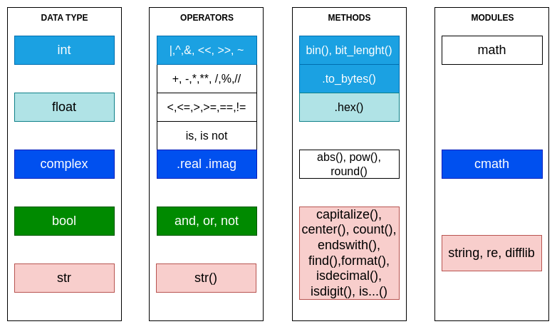

# Python
- [Python](#python)
  - [Main features](#main-features)
  - [Data types](#data-types)
    - [Simple data types](#simple-data-types)
    - [Data structures - containers / iterables](#data-structures---containers--iterables)
      - [Strings](#strings)
      - [Tuples](#tuples)
      - [Lists](#lists)
      - [Dictionaries / sets](#dictionaries--sets)
  - [Buil-in function list](#buil-in-function-list)
  - [Input/Output](#inputoutput)
  - [Flow control](#flow-control)
    - [Conditionals](#conditionals)
    - [Loops](#loops)
    - [Case](#case)
    - [Method/function definition](#methodfunction-definition)
  - [Functional programming](#functional-programming)
    - [Define anonymous functions](#define-anonymous-functions)
    - [Detailed generators](#detailed-generators)
    - [First-order functions](#first-order-functions)
  - [Decorators](#decorators)
  - [Comprehension definitions](#comprehension-definitions)

## Main features
Python is an interpreted scripting/programming language. There are differents 
supported programming paradigms in Python:

* Imperative
* Object-oriented
* Functional

Other main features are: 
* Dynamic typing
* Case-sensitive

For a complete reference of the Python STD lib, take a look 
[here](https://docs.python.org/3/library/index.html).

## Data types

### Simple data types
These are the main view of the data types on Python with the operators and some 
methods and the related modules for more operations. 

Also there is an special type named `NoneType` to represent the absence 
of a value.




### Data structures - containers / iterables
There are two main types of data structures, mutable and immutable, that have 
common operations.
* Mutable: list, dict and set.
* Immutable: tuple, range, str, and frozenset.
For these two main groups, there are common operations:

| Operation                                            | Syntax        |
| ---------------------------------------------------- | ------------- |
| Element presence, not presence                       | in, not in    |
| Concatenation, Itself concatenation                  | +, *          |
| Element access, Slice access, Slice access with step | [], [:], [::] |
| Lenght                                               | len()         |
| Smallest/Largest element                             | min(),max()   |
| 1st occurrence of element                            | index()       |
| Number of occurences                                 | count()       |

But, also each data structure has some particularities. Following sections 
provide an overview:

#### Strings
> TODO: vcorreal
#### Tuples
> TODO: vcorreal
#### Lists
> TODO: vcorreal
#### Dictionaries / sets
> TODO: vcorreal
## Buil-in function list
> TODO: vcorreal

## Input/Output
> TODO: vcorreal

## Flow control
As an imperative language, Python has loops and conditional structures:

### Conditionals
The conditionals on Python has the following syntax, where cond{1,2,3} are 
bool values:

```python
if cond1:
  whatever()
  whatever2()
elif cond2 or cond3: 
  whateverG()
else:
  whateverA()
```
Python defines also the else-if structure in one-line for assigments:
```python
x = 'even' if 5 % 2 == 0 else 'odd'
```

### Loops

Python has two looping strucutres, `while` and `for`, with the following syntax

```python
while cond1:
  whateverA()
  whateverB()
  whateverC()
```

```python
for it in sequence:
  whateverA()
  whateverB()
  whateverC()
```
### Case
Called `match` and introduced since Python3.10:
```python
 match status:
        case 400:
            return "Bad request"
        case 401 | 403 | 404:
            return "Not allowed"
        case 404 if cond1:
            return "Not found"
        case 418:
            return "I'm a teapot"
        case _:
            return "Something's wrong with the internet"
```

Python has other control flow statements:
* `break` for exit a loop.
* `continue` for going directly to the next iteration.
* Placing an `else` in a `for`/`while`, the code in thi scope will be executed 
  after the last iteration (if not used `break` to exit the loop).
* `pass` as a non-operation statement for complain the syntax.

### Method/function definition
For define a method/subroutine/function on Python `def` keyword is used.
> TODO: vcorreal

## Functional programming
Because everything in Python is an object, functions are as well an object, with 
the property that is **callable**. This enables functiona programming in Pytohn
(basically, a programming paradigm that doesn't allow side-effects). Also 
generates more readable codes.

> You can test if a variable is callale with callable(your_var)

### Define anonymous functions

You can define functions  with `def`, but sometimes for simplicity is better to 
define functions on the fly with the `lambda` syntaxis:

```python
lambda <parameter_list>: <expression>
add3 = lambda x, y, z : x + y + z
add3(1,1,1)
>>> 3
```
There are some limitations for the `lambda` functions:
1. You can't make a side-effect, for example update a global variable.
2. You can't return more than one value, as the other functions (you need to 
explicitly return a tuple)
3. Arguments are optional, this type of `lambda` function is called `generator` 
4. Need to be careful to use `lambda`s inside f-strings.

### Detailed generators

### First-order functions

A first-order function is a type of function that recive or returns
a functions as a parameter. There most usefull ones are listed below:

* map : Apply a function to single iterable object `(map(f,iter)`.
* filter: Filters all items that false for `lambda` function. `filter(f, iter)`
* multi-iterable map: Combine multiple iterables with a function, that needs
the same number of arguments as the iterables `(map(f,iter[,iter]...)`.

> This first order functions returns a generator, you can conver to a list 
> if you need it.

The module `functools` contains more first-order functions, some examples:
* reduce: Fold the elements of an interable object into one object. 
`reduce(f, iter)`

There are usefull pre-defined functions as multiply, add, etc in the `operator`
module.

## Decorators
> TODO: vcorreal

## Comprehension definitions
> TODO: vcorreal

