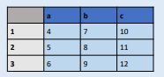

# Pandas

- [Pandas](#pandas)
  - [Series](#series)
    - [Series datatypes](#series-datatypes)
- [Read and export data](#read-and-export-data)
  - [Read](#read)
  - [Export](#export)
  - [Create from scratch](#create-from-scratch)
- [Selecting data](#selecting-data)
  - [Useful API calls](#useful-api-calls)
  - [Picking series and records](#picking-series-and-records)
- [Editing data](#editing-data)
- [Ploting data](#ploting-data)
- [Deriving new series](#deriving-new-series)
- [Statistics](#statistics)
- [Grouping and data-cleaning](#grouping-and-data-cleaning)
- [Reference](#reference)

Pandas is the state-of-art library for manage datasets for data analysis in Python. This library works on the top of Numpy.

The basic unit is the **DataFrame**, which is a 2-Dimensional table composed of **series**; each serie is a 1-dimensional array of data and a label named index.

> In the example, there are 3 series with index a, b and c and the dataframe
> is composed as the concat of this series.

The **records** of the **DataFrame** is a whole row, taking all the values from the series.

## Series

### Series datatypes

# Read and export data

## Read

## Export

## Create from scratch

# Selecting data

## Useful API calls

## Picking series and records

# Editing data

# Ploting data

# Deriving new series

# Statistics

# Grouping and data-cleaning

# Reference
For the complete user guide, you can go [here](https://pandas.pydata.org/docs/user_guide/), and for an introduction guide [here](https://pandas.pydata.org/docs/getting_started/intro_tutorials/index.html).
